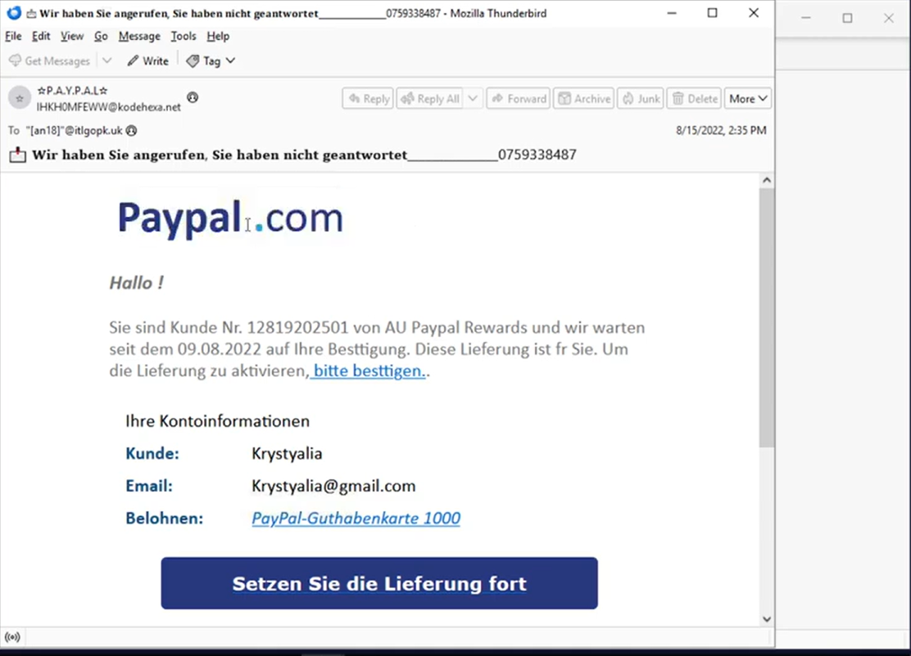
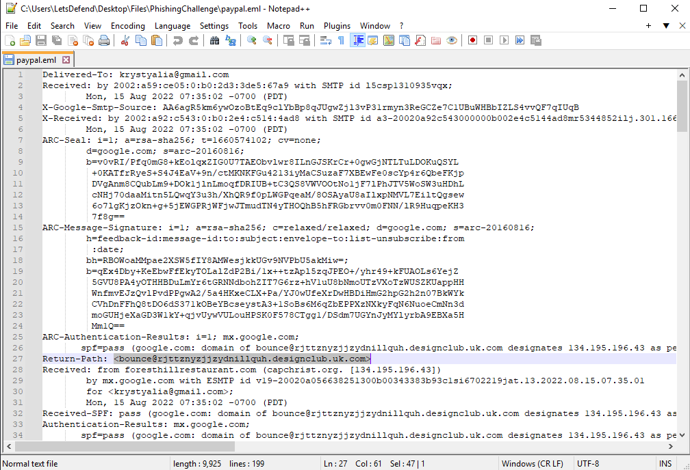
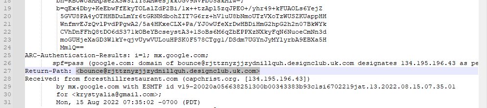
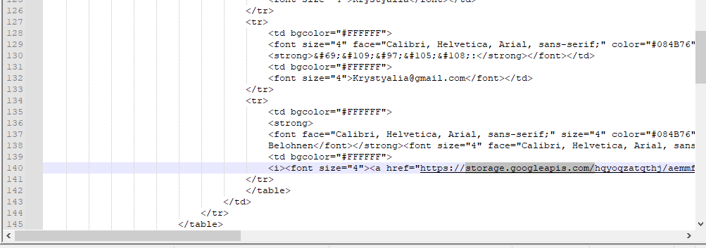
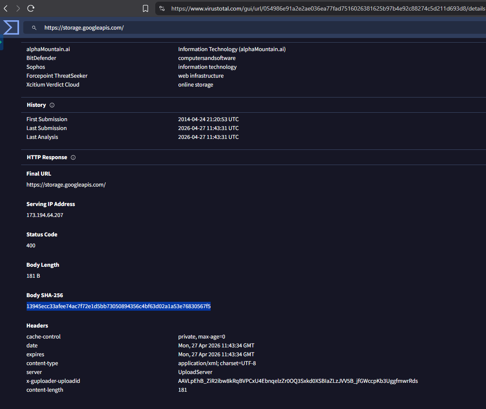

# 📧 Phishing Email Analysis – PayPal Scam

## 📌 Overview
In this lab, I analyzed a suspicious email that claimed to be from PayPal. The goal was to determine whether the email was legitimate or a phishing attempt.

---

## 🎯 Objective
- Analyze the email content and headers  
- Identify suspicious indicators  
- Confirm if the email is malicious  

---

## 🧪 Tools Used
- Notepad++  
- VirusTotal  

---

## 🔍 Investigation Steps

### Step 1: Open the Email
I opened the email provided in the lab. The message claimed to be from PayPal and asked the user to confirm information.

📸 Screenshot:  

➡️ Observation:  
The email design looks like PayPal, but it appears suspicious and not fully legitimate.

---

### Step 2: Analyze Email Headers
I opened the email file using Notepad++ to examine the full headers.

📸 Screenshot:  

---

### Step 3: Check Return-Path
I identified the Return-Path, which was different from the sender's address.

📸 Screenshot:  

➡️ Finding:  
This mismatch is a strong indicator of phishing.

---

### Step 4: Identify the Domain
I extracted the domain from the email headers for further analysis.

📸 Screenshot:  

---

### Step 5: Analyze with VirusTotal
I searched the domain/file using VirusTotal and obtained the SHA256 hash.

📸 Screenshot:  

➡️ Finding:  
The file/domain appeared clean, but this does not guarantee safety.

---

## 🚨 Findings

- Fake PayPal email  
- Return-Path mismatch  
- Suspicious domain  
- Social engineering attempt  

---

## 🧠 Conclusion

Based on the analysis, this email is a phishing attack.  
The attacker is محاولة خداع المستخدم ليضغط على الرابط ويقدم معلوماته.

---

## 📚 Skills Gained

- Email header analysis  
- Phishing detection  
- Using VirusTotal  
- Identifying indicators of compromise (IOCs)
