# 🛡️ SOC Automation & Advanced Threat Detection Lab  
(Wazuh SIEM + Sysmon + Shuffle SOAR)

---

## 📌 Overview

This project demonstrates building a modern SOC environment that covers the full attack lifecycle:

➡️ Detection → Analysis → Automated Response  

The lab focuses on detecting Credential Access attacks (Mimikatz) and handling Defense Evasion techniques such as file renaming.

---

## 🧱 Architecture

The lab simulates real-world log flow:

- 🖥 Windows 10 Endpoint (Sysmon enabled)  
- 🧩 Wazuh Agent  
- 📊 Wazuh Manager (Docker)  
- ⚡ Shuffle SOAR (Automation Layer)  

📸  
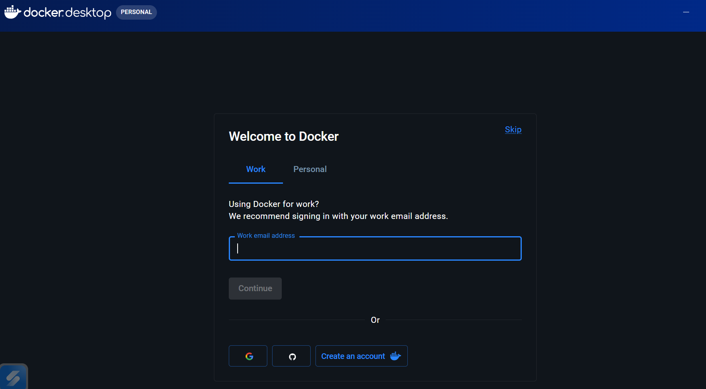

---

## ⚙️ Implementation

### 🔹 1. Wazuh Agent Setup

Connecting Windows machine to Wazuh server:

📸  
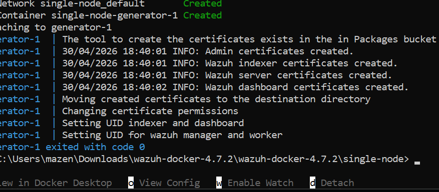

---

### 🔹 2. Editing Configuration Files

Modifying configuration files (ossec.conf / agent settings):

📸  
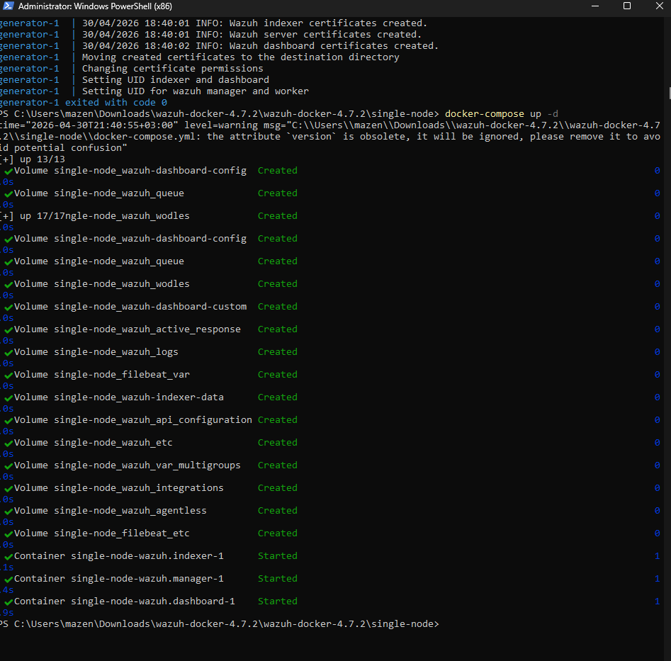

---

### 🔹 3. Wazuh Dashboard Verification

Verifying agent connection and status:

📸  
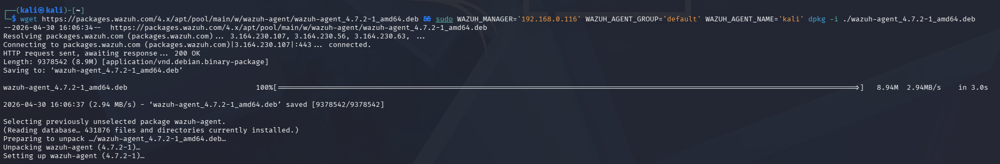

---

### 🔹 4. Log Collection Testing

Testing log flow and confirming data ingestion:

📸  
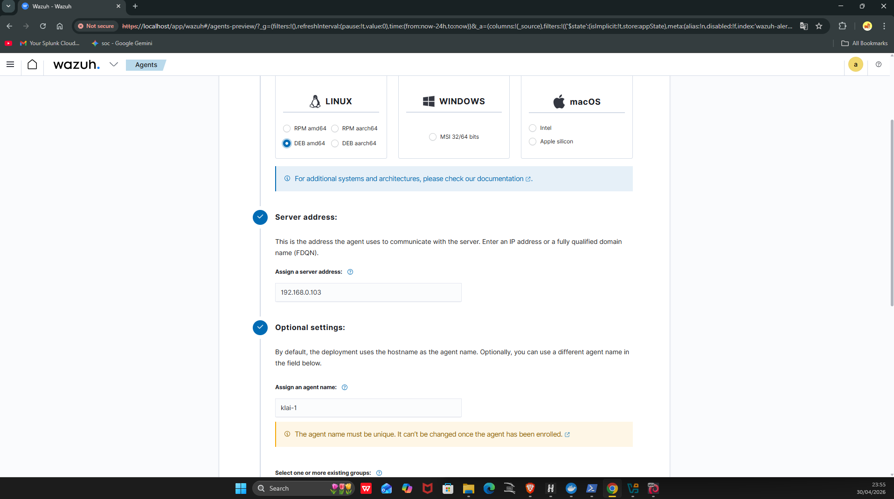

---

### 🔹 5. Deep Log Analysis

Inspecting raw logs for detailed visibility:

📸  
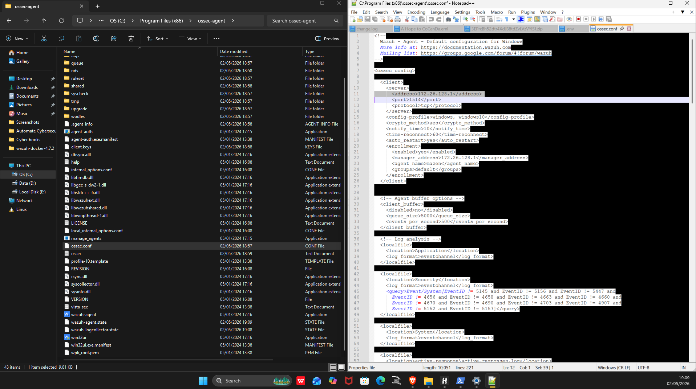

---

## 🔧 Configuration

### 🔹 1. Custom Detection Rules

Creating rules to detect suspicious behavior:

📸  
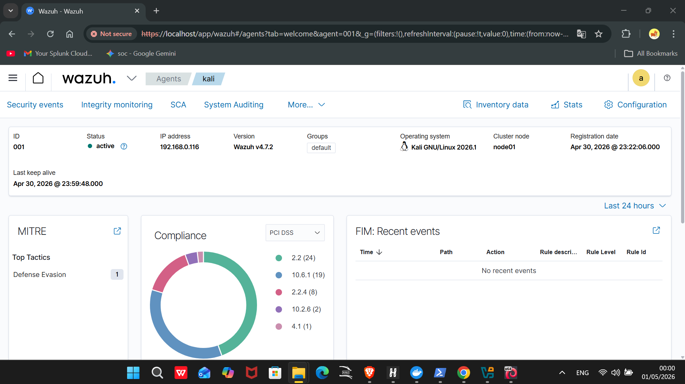

---

### 🔹 2. Sysmon Deployment

Installing Sysmon for enhanced monitoring:

📸  
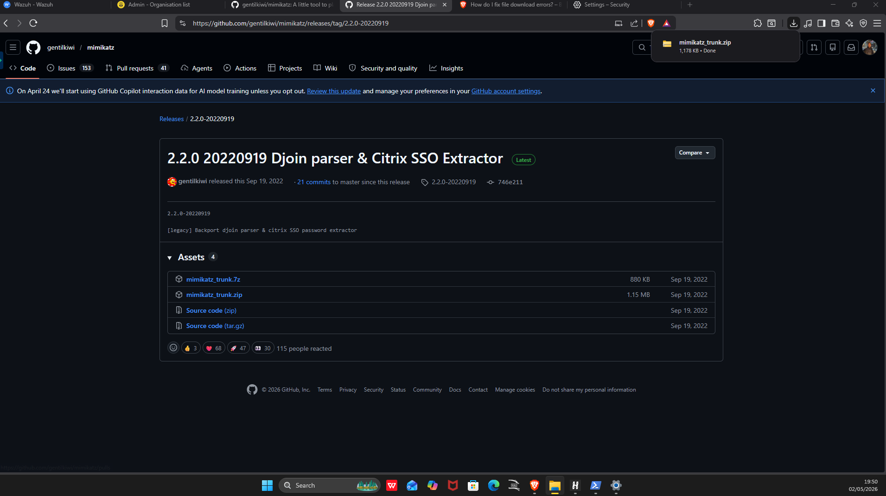

---

## 💣 Attack Simulation

### 🔹 1. Mimikatz Execution

Simulating credential dumping attack:

📸  
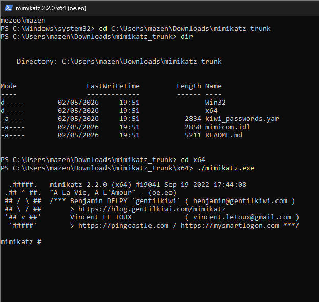

---

### 🔹 2. Additional Attack Validation

Extra validation/testing during attack phase:

📸  
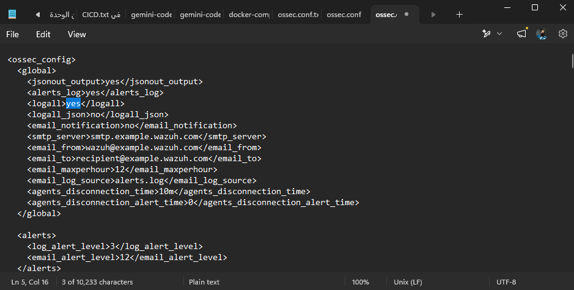

---

## 🚨 Detection & Results

### 🔹 1. Event Viewer Logs

Monitoring logs from Windows Event Viewer:

📸  
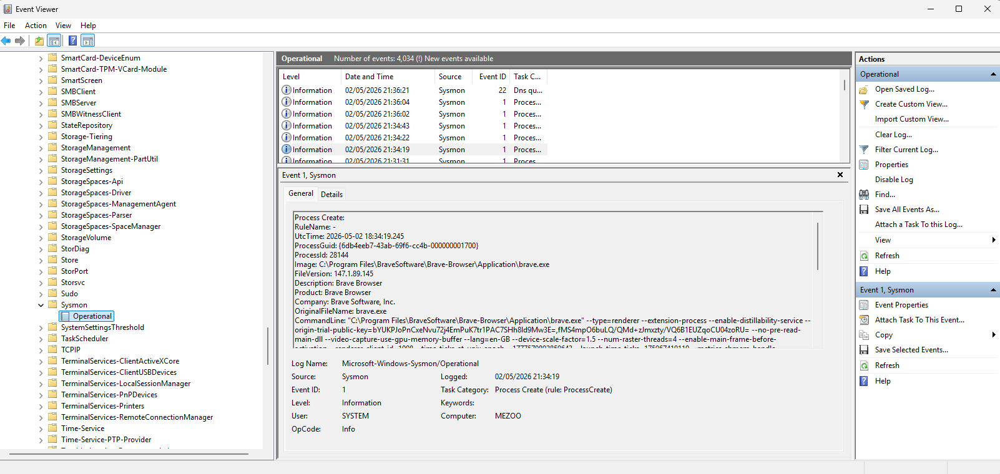

---

### 🔹 2. SIEM Detection Output

Viewing alerts and detections inside Wazuh:

📸  
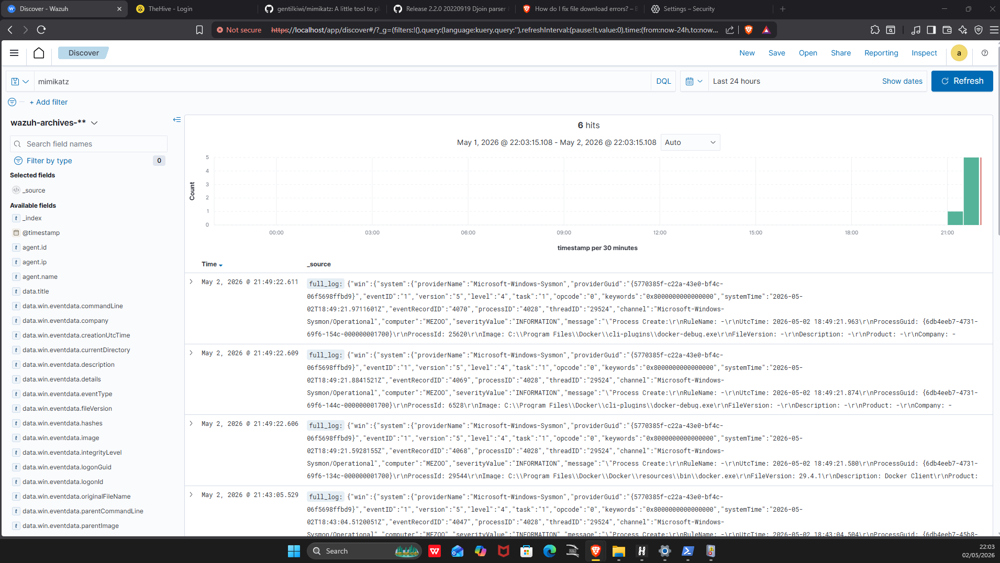

---

### 🔹 3. Rule Trigger Evidence

Proof of detection via custom rule:

📸  
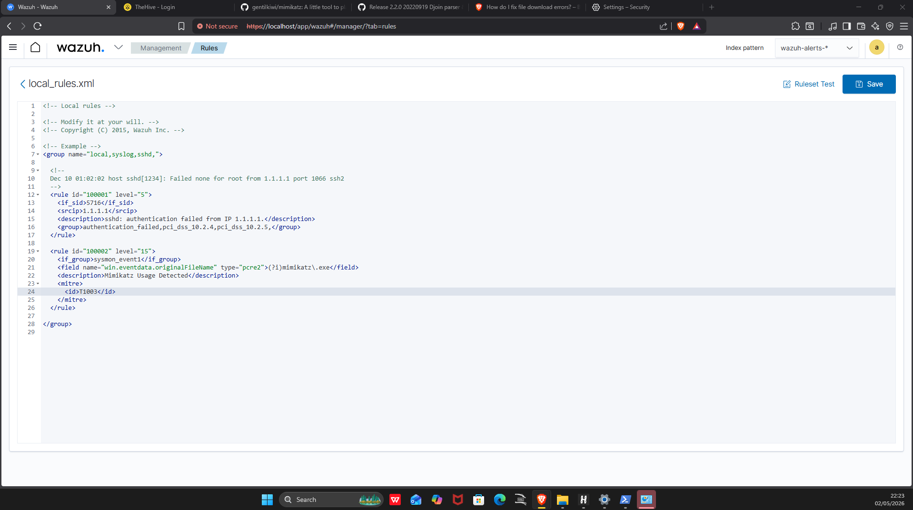

---

## ⚡ Automation (Shuffle SOAR)

### 🔹 1. Integration Configuration

Setting up Wazuh → Shuffle integration:

📸  
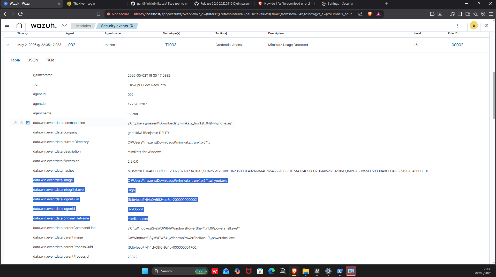

---

### 🔹 2. Shuffle Workflow

Automation workflow inside Shuffle:

📸  
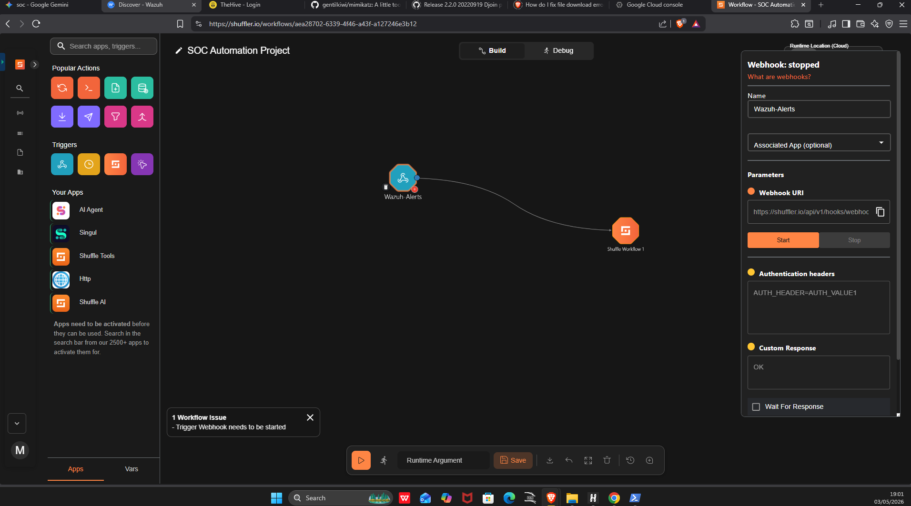

---

## 🎯 Key Achievements

- ✅ Built a SOC lab (SIEM + SOAR)  
- ✅ Integrated Wazuh with Shuffle automation  
- ✅ Detected credential dumping attacks  
- ✅ Bypassed attacker evasion techniques  
- ✅ Created custom detection rules  
- ✅ Mapped attack to MITRE ATT&CK (T1003)  
- ✅ Advanced SIEM Debugging (fixed integratord issues)  
- ✅ Linux-Docker interoperability handling  

---

## 🛠 Technical Challenges (Debugging Journey)

### 🔹 XML Structure Complexity

The wazuh-integratord module failed due to XML structure issues.

✔ Fixed by restructuring ossec.conf

---

### 🔹 Docker Environment Constraints

✔ Problem:
- CRLF vs LF formatting  

✔ Solution:
- Used printf to ensure correct Linux format  

---

### 🔹 Process Debugging

Used:
wazuh-integratord -dd

✔ Result:
- Fixed integration issues  
- Restored service  

---

## 🏁 Conclusion

This lab demonstrates a full SOC pipeline:

- 🔍 Sysmon → Visibility  
- 🧠 Wazuh → Detection  
- ⚡ Shuffle → Automation  

➡️ Result: Real-world capable threat detection & response system

- 🔍 Sysmon (Visibility)  
- 🧠 Wazuh (Detection)  
- ⚡ Shuffle (Automation)  

➡️ The environment demonstrates a complete Detection → Response pipeline capable of handling advanced threats.
