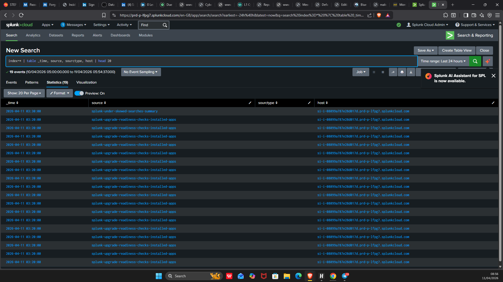
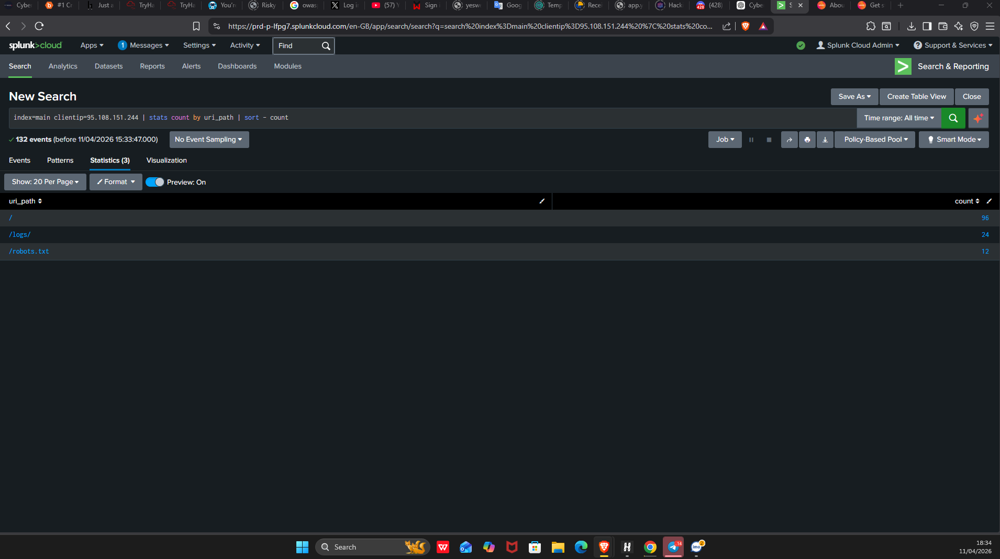
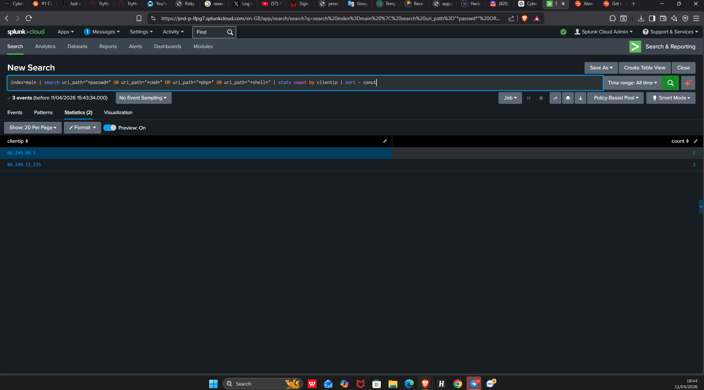

# 🛡 Investigation 2 - Web Traffic Analysis (Clean Activity)

## 📌 Scenario
Analyzing web traffic logs using Splunk to identify suspicious or malicious activity.

---

## 📊 Initial Log Exploration

Initial inspection of logs shows normal web traffic entries from multiple IP addresses.

---

## 🌐 Top Source IPs

Using:
index=main | stats count by clientip | sort - count

We identified the most active IP addresses.  
The highest IP generated the most events but this alone does not confirm malicious activity.

---

## 🔍 Focused Analysis on Top IP

Using:
index=main clientip=95.103.151.244 | stats count by uri_path | sort - count

The requests were mainly:
- /
- /robots.txt

➡️ This indicates normal browsing or bot activity.

---

## 🤖 User-Agent Analysis

Using:
index=main clientip=66.249.72.235 | stats count by useragent

Result:
- Googlebot detected

➡️ This confirms the traffic is from a legitimate search engine crawler.

---

## 🚨 Suspicious Activity Check

Using:
index=main uri_path="*passwd*" OR uri_path="*cmd*" OR uri_path="*sleep*" OR uri_path="*select*"

✔ No results found.

➡️ No signs of:
- SQL Injection  
- Command Injection  
- Path Traversal  

---

## 🧠 Findings

- High traffic observed from some IPs  
- All requests appear normal  
- Presence of legitimate bots (Googlebot, YandexBot)  
- No malicious patterns detected  

---

## ✅ Conclusion

The investigation confirms that the traffic is clean and non-malicious.

All activities observed are consistent with:
- Normal users  
- Search engine crawlers  

No security incident detected.

---

## 🟢 Severity
Low / Informational

---

## 🛠 Tools Used
- Splunk
